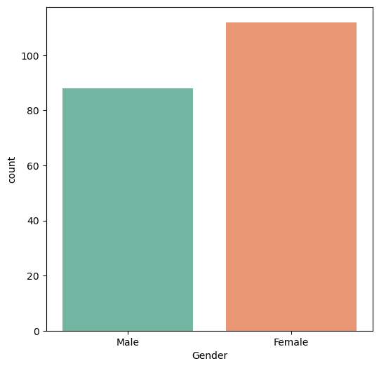
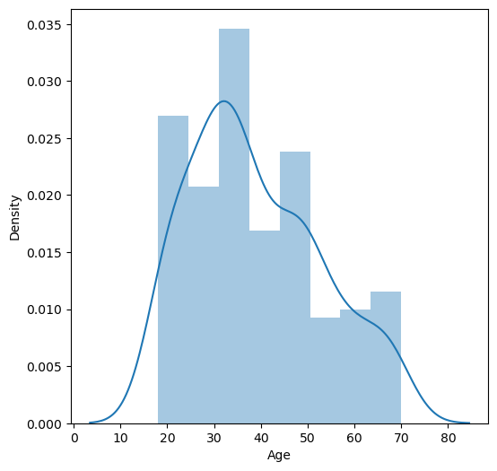
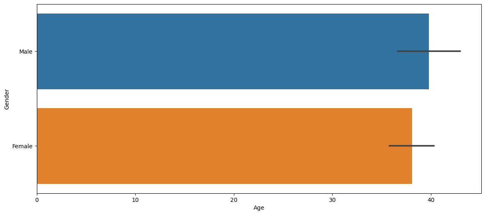
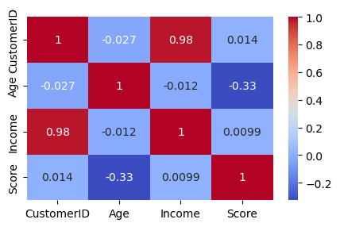
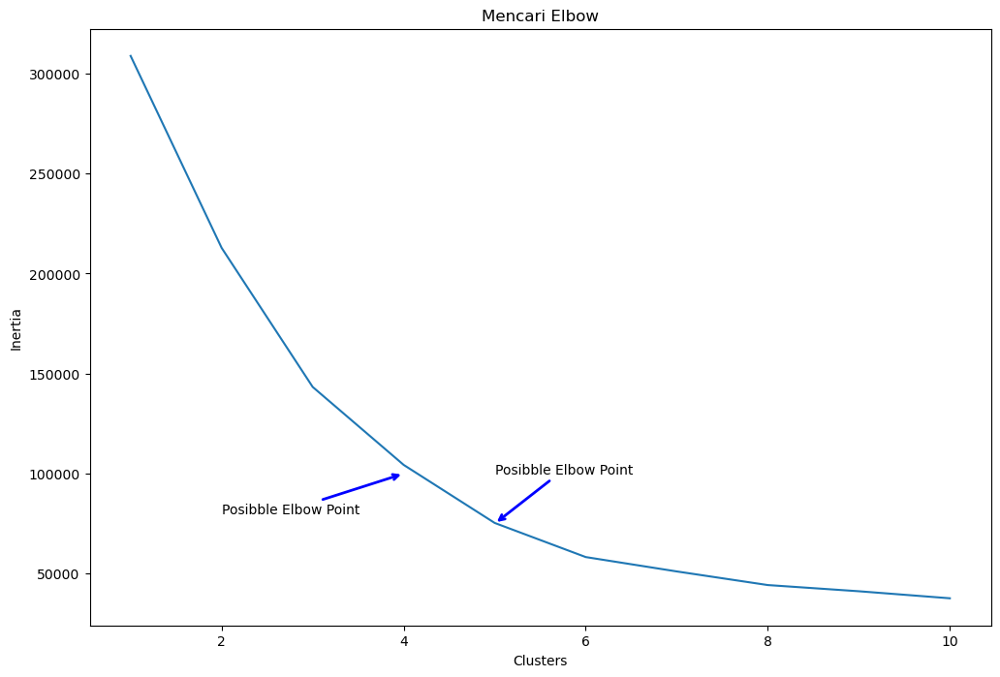
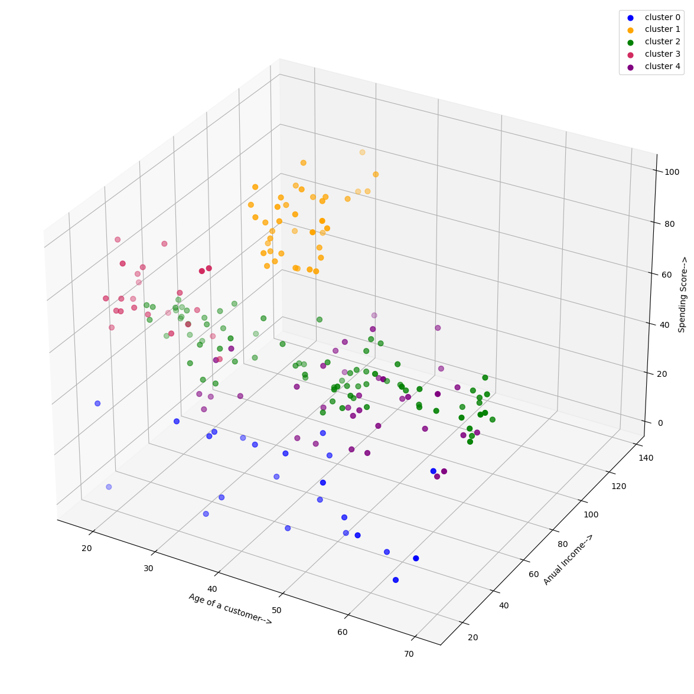
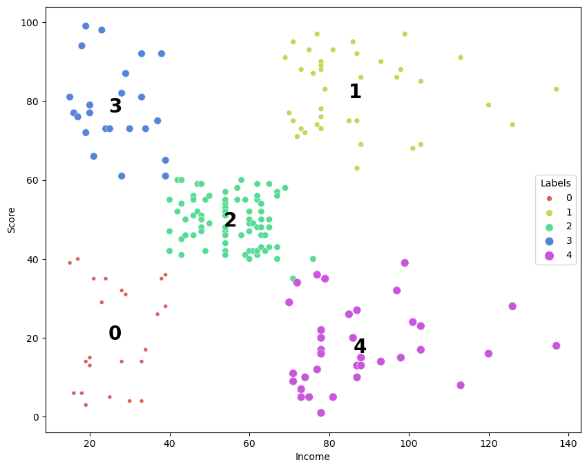

# Laporan Proyek Machine Learning
### Nama : Putri Rezita Amelia
### Nim : 211351114
### Kelas : Pagi B

## Domain Proyek

Proyek ini bertujuan untuk mengembangkan sebuah aplikasi clustering segmentasi konsumen yang dapat membantu perusahaan untuk mengidentifikasi dan memahami kelompok-kelompok konsumen berdasarkan karakteristik tertentu

**Rubrik/Kriteria Tambahan (Opsional)**:
- Dalam lingkungan bisnis yang dinamis, perusahaan perlu mampu beradaptasi dengan perubahan dalam perilaku konsumen. Mempelajari perilaku konsumen tidak lagi hanya sebatas menganalisis data transaksi atau survei konsumen, melainkan juga memanfaatkan teknologi analisis data tingkat tinggi seperti clustering
- Mengelompokkan data dengan algoritma K-Means dilakukan dengan cara menentukan jumlahcluster, hitung jarak terdekat dengan pusat cluster. Data  dengan jarak terdekat menyatakan anggota dari cluster tersebut,dilakukan perhitungan kembali  sampai data tidak berpindah pada cluster lain, untuk meminimalkan fungsi objektif
  
  Format Referensi: [IMPLEMENTASI DATA MINING PEMILIHAN PELANGGAN POTENSIAL MENGGUNAKAN ALGORITMA K-MEANS](https://journal.ipm2kpe.or.id/index.php/INTECOM/article/view/141/69) 

## Business Understanding

### Problem Statements

Menjelaskan pernyataan masalah latar belakang:
- Perusahaan menghadapi tantangan dalam mengidentifikasi dan memahami kelompok-kelompok konsumen yang berbeda di pasar mereka

### Goals

Menjelaskan tujuan dari pernyataan masalah:
- Meningkatkan efektivitas strategi pemasaran, penyesuaian produk, dan kepuasan pelanggan dengan memahami karakteristik dan preferensi yang berbeda di antara segmen konsumen

## Data Understanding
Dataset yang saya gunakan bersumber dari kaggle yang memuat mengenai beberapa data dasar tentang pelanggan seperti ID Pelanggan, usia, jenis kelamin, pendapatan tahunan, dan skor pengeluaran.
Spending score adalah sesuatu yang Anda tetapkan kepada pelanggan berdasarkan parameter yang Anda tentukan seperti perilaku pelanggan dan data pembelian.

Link Dataset : [Mall Customer Segmentation Data](https://www.kaggle.com/datasets/vjchoudhary7/customer-segmentation-tutorial-in-python).<br> 

### Variabel-variabel pada Mall Customer Segmentation Dataset adalah sebagai berikut:
- CusomerID : merupakan ID pelanggan yang bersifat unik. (int64, unique)
- Gender : merupakan jenis kelamin pelanggan meliputi [Male, Female]. (categorical)
- Age : adalah usia dari pelanggan (int64)
- Annual Income : merupakan pendapatan pertahun dari pelanggan (int64)
- Spending Score : adalah sesuatu yang Anda tetapkan kepada pelanggan berdasarkan parameter yang Anda tentukan seperti perilaku pelanggan dan data pembelian (int64)

**Exploratory Data Analysis (EDA)**:
untuk melihat jenis kelamin dari konsumen
```bash
plt.figure(1 , figsize = (6 , 6))
sns.countplot(x = 'Gender' , data = df, palette='Set2')
plt.show()
```
<br>
untuk menampilkan umur dari konsumen
```bash
plt.figure(figsize=(6, 6))
sns.distplot(df["Age"])
plt.xlabel("Age")
plt.show()
```
<br>
untuk melihat perbandingan gender berdasarkan umur
```bash
plt.figure(figsize = (14,6))
sns.barplot(data=df, x="Age", y="Gender")
plt.show()
```
<br>
untuk melihat korelasi dari setiap atribut data dengan menggunakan heatmap
```bash
corr_matrix = df.corr()

plt.figure(figsize = (5, 3))
ax = sns.heatmap(corr_matrix,
                 annot = True,
                 cmap = 'coolwarm')
```
<br>
untuk membuat matrix scatterplot dari 3 atribut yaitu umur penghasilan dan score
```bash
plt.figure(1 , figsize = (15 , 7))
n = 0
for x in ['Age' , 'Income' , 'Score']:
    for y in ['Age' , 'Income' , 'Score']:
        n += 1
        plt.subplot(3 , 3 , n)
        plt.subplots_adjust(hspace = 0.5 , wspace = 0.5)
        sns.regplot(x = x , y = y , data = df)
        plt.ylabel(y.split()[0]+' '+y.split()[1] if len(y.split()) > 1 else y )
plt.show()
```
<br>
## Data Preparation
Pertama kita mengupload data yang telah kita unduh dari kaggle
```bash
from google.colab import files
files.upload()
```
lalu konfigurasi akses API Kaggle
```bash
!mkdir -p ~/.kaggle
!cp kaggle.json ~/.kaggle/
!chmod 600 /root/.kaggle/kaggle.json
!ls ~/.kaggle
```
kemudian unduh dataset yang telah kita pilih
```bash
!kaggle datasets download -d vjchoudhary7/customer-segmentation-tutorial-in-python
```
lalu untuk membuka file data yang telah kita unduh
```bash
!mkdir customer-segmentation-tutorial-in-python
!unzip customer-segmentation-tutorial-in-python.zip -d customer-segmentation-tutorial-in-python
!ls customer-segmentation-tutorial-in-python
```
selanjutnya import library apa saja yang ingin digunakan dalam proyek ini
```bash
import pandas as pd
import matplotlib.pyplot as plt
import seaborn as sns
import pickle
import plotly.graph_objs as go
from sklearn.cluster import KMeans
```
kemudian import dataset yang telah diunduh
```bash
df = pd.read_csv('Mall_Customers.csv')
```
untuk menampilkan dataset mengetahui apakah sudah terimport
```bash
df.head()
```
mengganti kolom income dan juga score
```bash
df.rename(index=str,columns={
    'Annual Income (k$)' : 'Income' , 'Spending Score (1-100)' : 'Score'
}, inplace=True)
```
fitur yang akan digunakan hanyalah umur, pemasukan dan score
```bash
x = df.iloc[:,[2,3,4]].values
```

## Modeling
mencari titik elbow dari fitur
```bash
clusters = []
for i in range(1,11):
    km = KMeans(n_clusters=i)
    km.fit(x)
    clusters.append(km.inertia_)

fig, ax = plt.subplots(figsize=(12,8))
sns.lineplot(x=list(range(1,11)),y=clusters,ax=ax)
ax.set_title('Mencari Elbow')
ax.set_xlabel('Clusters')
ax.set_ylabel('Inertia')

ax.annotate('Posibble Elbow Point', xy=(4,100000), xytext=(2,80000), xycoords='data',
            arrowprops=dict(arrowstyle='->',connectionstyle='arc3',color='blue',lw=2))
ax.annotate('Posibble Elbow Point', xy=(5,75000), xytext=(5,100000), xycoords='data',
            arrowprops=dict(arrowstyle='->',connectionstyle='arc3',color='blue',lw=2))
```
<br>
memasukan jumlah cluster dan kondisi atau syarat dari model
```bash
n_clust = 5
kmean =KMeans(n_clusters=n_clust, init = "k-means++", max_iter = 300, n_init = 10, random_state = 0)
y_clusters = kmean.fit_predict(x)
```

## Evaluation
Setelah model berhasil dijalankan kemudian kita lihat hasil dari model terhadap data
```bash
fig = plt.figure(figsize = (15,15))
ax = fig.add_subplot(111, projection='3d')
ax.scatter(x[y_clusters == 0,0],x[y_clusters == 0,1],x[y_clusters == 0,2], s = 40 , color = 'blue', label = "cluster 0")
ax.scatter(x[y_clusters == 1,0],x[y_clusters == 1,1],x[y_clusters == 1,2], s = 40 , color = 'orange', label = "cluster 1")
ax.scatter(x[y_clusters == 2,0],x[y_clusters == 2,1],x[y_clusters == 2,2], s = 40 , color = 'green', label = "cluster 2")
ax.scatter(x[y_clusters == 3,0],x[y_clusters == 3,1],x[y_clusters == 3,2], s = 40 , color = '#D12B60', label = "cluster 3")
ax.scatter(x[y_clusters == 4,0],x[y_clusters == 4,1],x[y_clusters == 4,2], s = 40 , color = 'purple', label = "cluster 4")
ax.set_xlabel('Age of a customer-->')
ax.set_ylabel('Anual Income-->')
ax.set_zlabel('Spending Score-->')
ax.legend()
plt.show()
```
<br>
agar 3d bisa dilihat dengan lebih jelas
```bash
Scene = dict(xaxis = dict(title  = 'Age -->'),yaxis = dict(title  = 'Spending Score--->'),zaxis = dict(title  = 'Annual Income-->'))

labels = kmean.labels_
trace = go.Scatter3d(x=x[:, 0], y=x[:, 1], z=x[:, 2], mode='markers',marker=dict(color = labels, size= 10, line=dict(color= 'black',width = 10)))
layout = go.Layout(margin=dict(l=0,r=0),scene = Scene,height = 800,width = 800)
data = [trace]
fig = go.Figure(data = data, layout = layout)
fig.show()
```
kemudian final data kita muat dalam variable untuk kemudian di visualisasi kembali
```bash
clusteringdata = pd.DataFrame(x, columns=['Age', 'Income', 'Score'])
clusteringdata['Labels']=kmean.labels_
clusteringdata
```
kemudian visualisasi kembali data yang telah dikelompokan masih dalam scatterplot untuk melihat sebaran datanya agar lebih mudah
```bash
plt.figure(figsize=(10,8))
sns.scatterplot(x='Income', y='Score', hue='Labels', marker='o', size='Labels', palette=sns.color_palette('hls', n_colors=n_clust), data=clusteringdata)

for label in clusteringdata['Labels'].unique():
    plt.annotate(label,
                 (clusteringdata[clusteringdata['Labels']==label]['Income'].mean(),
                  clusteringdata[clusteringdata['Labels']==label]['Score'].mean()),
                  horizontalalignment='center',
                  verticalalignment='center',
                  size=20, weight='bold',
                  color='black')

```
<br>
## Deployment
setelah model berhasil dijalankan kemudian luncurkan model dalam bentuk aplikasi melalui streamlit<br>
Link Apk : [Aplikasi Clustering Segmentasi Konsumen](https://tugasuas-mkktaawx9jqxcbenk5rmna.streamlit.app/)

**---Ini adalah bagian akhir laporan---**